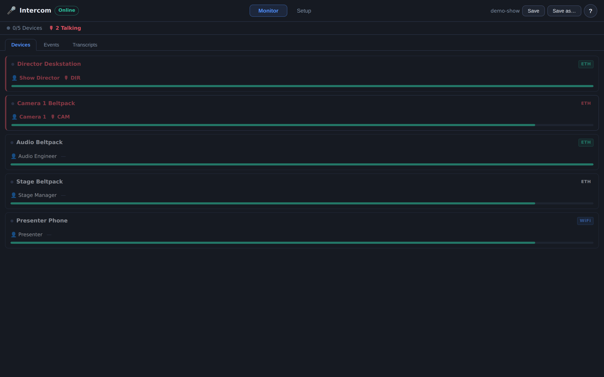
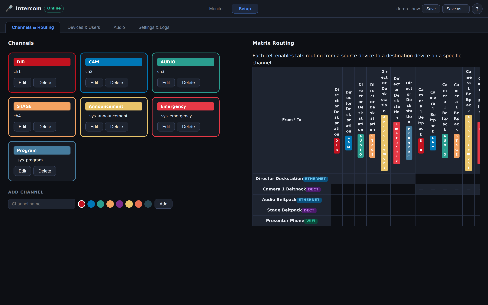
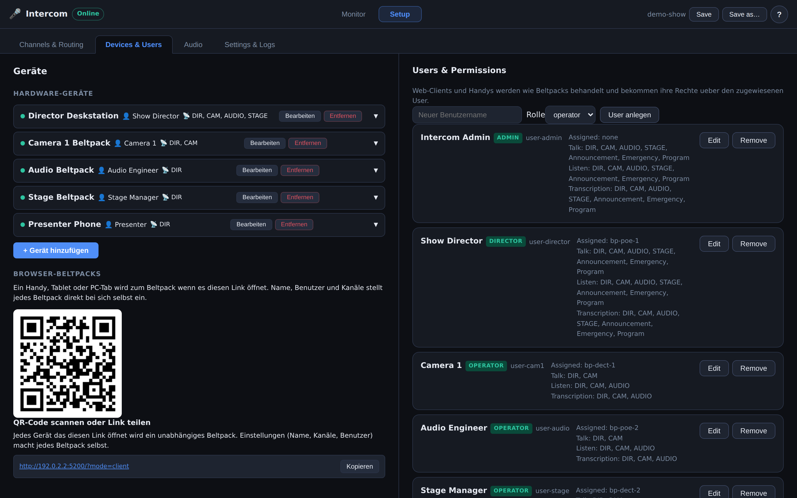
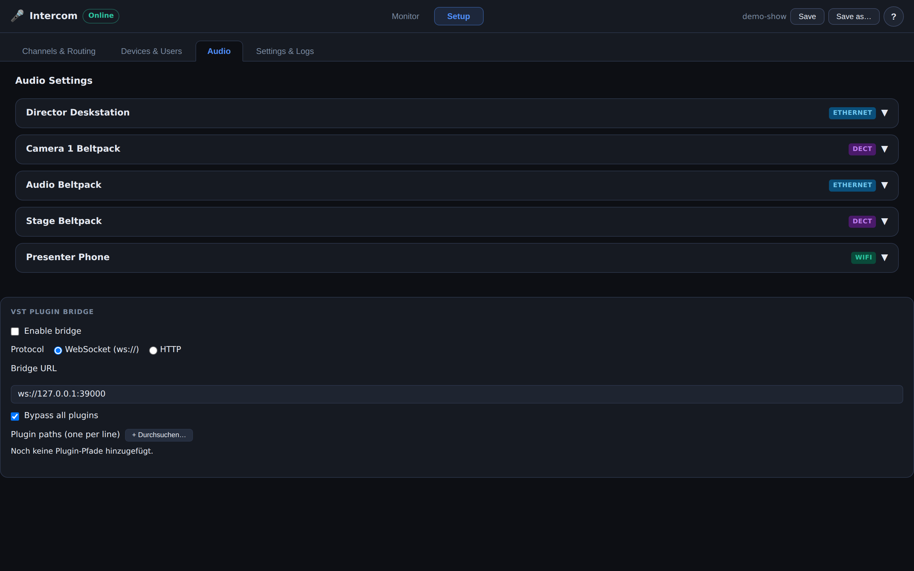
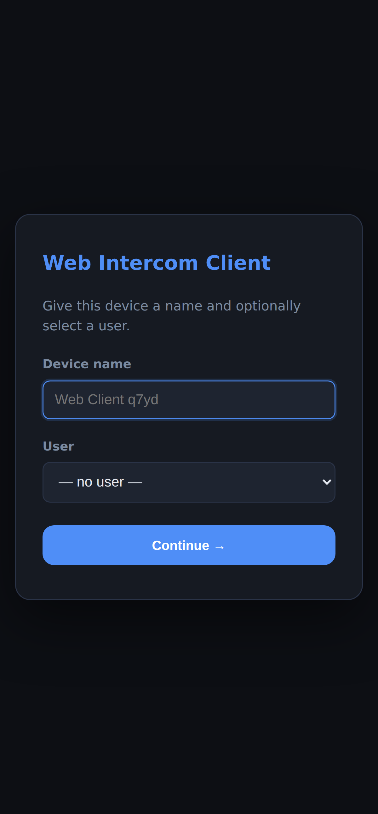
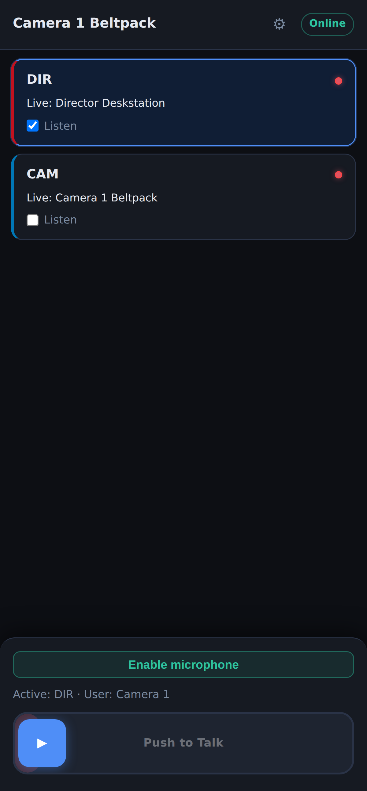
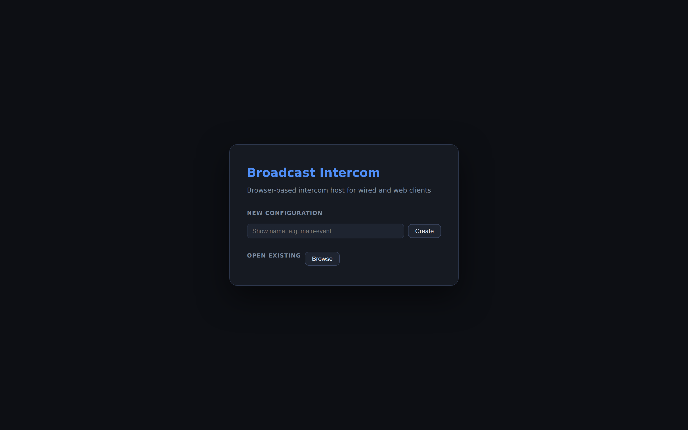

# Broadcast Intercom

A self-hosted, browser-based production intercom system for live events and broadcast productions. Inspired by the architecture of [Green-GO](https://green-go.eu) wireless intercoms and the open-source [Eyevinn Open Intercom](https://github.com/Eyevinn/intercom-manager) project.

> ⚠️ **Currently under development.**

---

## The web page

Every push to the default branch builds this repo's page from
`.github/workflows/pages.yml` and publishes it:

**https://larszu.github.io/Broadcast-intercom/**

The workflow **asks the Pages API before it configures anything.** With no
Pages site it still builds — that is a real check — and skips only the
publishing step, with a warning and the one missing step in the run summary.
A run that must stay red for a click nobody made teaches people to ignore red.

Measured 2026-09-09: **built, not published.** The build runs and passes; the
`deploy` job is skipped because this repo has no Pages site yet. That switch is
the one thing no workflow can flip (`GITHUB_TOKEN` may not create a site):
Settings → Pages → Source → **GitHub Actions**. After that the next push
publishes by itself — nothing in this repo needs changing.

---
## Features

- **Group channels (Partylines)** — multi-party talk groups, each user can hold up to 8 configurable slots
- **System channels** — three always-present channels: Announcement, Emergency, Program
- **Direct calls** — temporary 1:1 channels that auto-open when a user initiates a call, no pre-configuration on the receiver side
- **User Profiles / Presets** — per-user slot configuration (which groups/direct targets/system channels appear on each slot)
- **Role-based permissions** — `admin`, `director`, `operator`, `talent` roles gate talk/listen/transcription and management rights
- **Device Manager** — hardware beltpacks (Ethernet/DECT/WiFi) with full config; browser beltpacks via invite link
- **Companion / Stream Deck control** — REST control endpoint plus a ready-to-use [Bitfocus Companion module](companion-module/) (`companion-module/`)
- **Audio transcription** — optional Vosk speech-to-text per channel
- **Plugin Bridge** — optional VST/audio plugin integration via WebSocket
- **Intercom plan import** — reads the vendor-neutral `avplan-intercom` file the AV Planner Suite exports: conferences, stations, and talk/listen kept apart. Merged by name, never deleting ([details](docs/plan-import.md))

---

## Screenshots

### Operator UI — Monitor
Live view of every beltpack: transport (ETH/DECT/WiFi), assigned user and channel, and who is currently talking (highlighted red).



### Setup — Channels & Routing
Manage group and system channels and the point-to-point talk **routing matrix** between devices.



### Setup — Devices & Users
Hardware and browser beltpacks on the left; users, roles and per-channel talk/listen/transcription permissions on the right. A QR code / invite link turns any phone or tablet into a browser beltpack.



### Setup — Audio & Plugin Bridge
Per-device audio settings and the optional VST/audio plugin bridge configuration.



### Browser beltpack (phone / tablet)
Open the client link on any device to turn it into an independent beltpack — pick a name and user (left), then push-to-talk with per-channel listen and live talk indicators (right).

<p>
  
  &nbsp;&nbsp;
  
</p>

### Start screen
Create a new show configuration or open a saved one.



> Screens are captured from the running app with seeded demo data (`docs/screenshots/`).

---

## Documentation

- [**`docs/README.md`**](docs/README.md) — index of everything: architecture
  draft, feature backlog, the Companion module reference, plus a quick
  reference and the data-flow diagram.

`npm run docs:reachable` fails the build if a document under `docs/` is not
reachable by links from an entry page. All three were orphaned until
2026-09-04 — including `docs/README.md` itself, which was already a good index
that nobody linked.

---

## Architecture

```
Broadcast-intercom/
├── apps/
│   ├── server/            Node.js + Express + WebSocket core (port 4001)
│   └── web/               React + Vite 6 operator UI (dev port 5200)
├── packages/
│   └── shared/            Common TypeScript types (shared between server & web)
├── companion-module/      Bitfocus Companion module for Stream Deck control
├── scripts/
│   └── smoke-test.mjs     Headless REST + WebSocket functional test
└── data/
    ├── configs/           Saved show configurations (JSON)
    └── models/            Vosk speech model (optional)
```

**Tech stack:**
- Runtime: Node 20 (via [fnm](https://github.com/Schniz/fnm); `.node-version` pins 20)
- Server: Express 4, `ws` WebSocket library, `tsx` for TypeScript execution
- Frontend: React 19, Vite 6, CSS-only styling (no CSS framework)
- HTTPS (optional): [mkcert](https://github.com/FiloSottile/mkcert) local CA — the dev server falls back to plain HTTP when no certificates are present

---

## Getting Started

### Prerequisites

```powershell
winget install Schniz.fnm
fnm install 20
fnm use 20
# Optional — only needed for HTTPS / microphone access on a LAN:
winget install FiloSottile.mkcert
mkcert -install
```

> On macOS/Linux use your package manager (`brew install fnm mkcert`, etc.). Node 20+ is required; the project runs on Node 22 as well.

### Installation

```bash
git clone https://github.com/larszu/Broadcast-intercom.git
cd Broadcast-intercom
npm install
```

**Optional — HTTPS certificates** (needed for microphone access from other devices on the LAN):

```bash
cd apps/web
mkdir certs
mkcert -cert-file certs/localhost+4.pem -key-file certs/localhost+4-key.pem localhost 127.0.0.1 ::1 YOUR_LAN_IP
cd ../..
```

Without certificates the web dev server automatically serves plain HTTP — everything still works for local development.

### Running

```bash
./dev.sh               # Linux / macOS — server + web UI with simulated beltpacks
./dev.sh --no-mock     # …without the simulation (real devices on the network)
./dev.sh --server      # server only (headless, for Companion / tests)

.\dev.ps1              # Windows — same three, via -NoMock / plain
```

Or the npm scripts directly:

```bash
npm run dev            # server (:4001) + web UI (:5200)
npm run dev:mock       # same, with simulated beltpacks generating live traffic
npm run dev:server     # server only (useful for headless testing / Companion)
```

Open **http://localhost:5200** (or `https://` if you generated certificates).

**No hardware needed.** `dev:mock` spawns simulated beltpacks that generate
live traffic; the whole intercom — channels, calls, audio control, the plan
contract — can be exercised on a laptop. `dev.sh` uses it by default and
checks the Node version *before* starting, so a too-old Node fails with a
sentence about the version instead of a syntax error somewhere inside the
bundler.

**Other devices on the same network.** The server binds every interface, and
on startup it now prints the addresses you can actually hand out:

```
Intercom core on http://localhost:4001
               http://192.168.1.42:4001  (im selben Netz)
```

Before, only `localhost` was printed — the server was reachable from the LAN
the whole time and nobody was told under which address. All detected
addresses are listed rather than one being guessed: on a machine with a
Docker or VPN bridge the first one is often the wrong one, and whoever reads
the list recognises their own. The web UI (`:5200`) already serves on every
interface via Vite's `host: true`.

For microphone access from another device the browser needs HTTPS — that is
what the optional mkcert step above is for.

---

## Testing (headless)

The core can be fully exercised without a browser. Start the server, then run the smoke test:

```bash
npm run dev:server          # terminal 1
npm run test:smoke          # terminal 2  (override target with BASE=http://host:port)
```

`scripts/smoke-test.mjs` verifies the REST CRUD surface, the Companion control
endpoint (PTT / mute / volume / emergency, including error paths), config
persistence, and the WebSocket lifecycle (device registration, talk events,
direct-call temporary channels).

The Companion module has its own end-to-end test that drives the real module
logic against a running core — see [`companion-module/`](companion-module/).

To confirm everything compiles:

```bash
npm run build               # builds shared → server → web
```

---

## Bitfocus Companion module

[`companion-module/`](companion-module/) is a full [Bitfocus Companion](https://bitfocus.io/companion)
connection module that turns a Stream Deck into an intercom control surface:

- **Actions** — push-to-talk (slot or named channel), mute/unmute, volume, emergency, direct call start/end, load config
- **Feedbacks** — device talking, muted, offline, battery low, emergency active, core connected
- **Variables** — connection state, active config, device/user/channel counts, and per-device talk/battery/online values
- **Presets** — ready-to-drop PTT, mute, volume, emergency and status buttons

It keeps a live WebSocket to the core for instant feedback and sends commands to
`POST /api/control/action`. See the [module README](companion-module/README.md)
for install, build and test instructions.

---

## Green-GO Inspired Concepts

| Concept | This System |
|---|---|
| Group (Partyline) | `IntercomGroup` + `Channel` with `type: "group"` |
| Direct Call | `TemporaryChannel` — auto-created, no receiver pre-config needed |
| User Config | `UserProfile` with `ChannelSlot[]` (up to 8 slots per user) |
| System Channels | `__sys_announcement__`, `__sys_emergency__`, `__sys_program__` — always present |
| Channel Slot | `ChannelSlot` — each slot points to a group, direct target, or system channel |

Each slot in a `UserProfile` can be one of:
- `{ type: "group", groupId }` — talk/listen to a group
- `{ type: "direct", userId }` — dedicated button for direct call to a user
- `{ type: "system", channelId }` — always-on system channel

---

## Eyevinn-Inspired Concepts

| Eyevinn Term | This System |
|---|---|
| Production | Config / Show configuration |
| Line | Channel / Group |
| Preset | `UserProfile` |
| Session/Participant | `ClientSession` |
| Companion Actions | `ControlAction` via `POST /api/control/action` |

---

## API Reference

### WebSocket (`ws://localhost:4001/ws`)

On connect the server immediately sends a full `state` message; thereafter it
pushes `state` / `event` messages on every change.

**Client → Server:**

| Type | Payload |
|---|---|
| `register_device` | `{ id, label, transport, role?, userId?, channelIds?, connectedAntennaId? }` |
| `register_antenna` | `{ id, label, location }` |
| `heartbeat` | `{ id, battery?, network? }` |
| `assign_channels` | `{ id, channelIds }` |
| `set_talk` | `{ id, channelId, active }` |
| `set_listen` | `{ id, channelIds }` |
| `set_transcription_channels` | `{ id, channelIds }` |
| `set_user` | `{ id, userId? }` |
| `direct_call` | `{ fromDeviceId, toUserId }` |
| `direct_call_end` | `{ tempChannelId }` |
| `transcribe_audio` | `{ id, channelId, sampleRate, audio }` |

**Server → Client:**

| Type | Payload |
|---|---|
| `state` | Full `CoreState` |
| `event` | `EventItem` |
| `audio_chunk` | `{ fromDeviceId, channelId, sampleRate, audio }` |
| `temp_channel_opened` | `TemporaryChannel` |
| `temp_channel_closed` | `{ tempChannelId }` |

### REST endpoints

| Method | Path | Description |
|---|---|---|
| GET | `/api/state` | Full state |
| GET/POST | `/api/users` | List / create users |
| PATCH/DELETE | `/api/users/:id` | Update / delete user |
| POST | `/api/channels` | Create channel |
| PATCH/DELETE | `/api/channels/:id` | Update / delete channel |
| GET/POST | `/api/groups` | List / create groups |
| PATCH/DELETE | `/api/groups/:id` | Update / delete group |
| GET/POST | `/api/profiles` | List / create profiles |
| PATCH/DELETE | `/api/profiles/:id` | Update / delete profile |
| POST | `/api/devices` | Add device |
| PATCH/DELETE | `/api/devices/:id` | Update / delete device |
| PATCH | `/api/devices/:id/audio` | Update device audio settings |
| PATCH | `/api/devices/:id/user` | Assign device to user |
| GET | `/api/sessions` | Active WebSocket sessions |
| POST | `/api/control/action` | Companion control action |
| PATCH | `/api/matrix` | Set a matrix route (from → to on channel) |
| GET/PATCH | `/api/audio/plugin-bridge` | Plugin bridge config |
| GET | `/api/transcription/status` | Vosk model / module status |
| POST | `/api/transcription/model/install` | Download & install a Vosk model |
| GET | `/api/configs` | List saved configs + active |
| POST | `/api/configs/new` \| `/load` \| `/save` | Create / load / save a config |
| DELETE | `/api/configs/:name` | Delete a saved config |
| GET | `/api/network/hosts` | LAN IP addresses + server port |
| GET | `/api/fs/list?path=` | Server-side file browser (plugin paths) |
| POST | `/api/plan/preview` | Compare an `avplan-intercom` plan against this system — changes nothing ([details](docs/plan-import.md)) |
| POST | `/api/plan/apply` | Apply that plan: merge conferences and stations by name, never delete |

**`ControlAction` values (`POST /api/control/action`):**
`ptt_start`, `ptt_stop`, `mute_input`, `mute_output`, `set_selected_slot`, `volume_up`, `volume_down`, `direct_call_start`, `direct_call_end`, `emergency_start`, `emergency_stop`

Request body: `{ action, deviceId?, slotIndex? }`. Actions that target a device
(`ptt_*`, `mute_*`, `volume_*`) require a valid `deviceId`; `ptt_*` uses
`slotIndex` to pick the channel from the device's assigned channels.

---

## Environment variables (server)

| Variable | Default | Purpose |
|---|---|---|
| `PORT` | `4001` | Core HTTP/WebSocket port |
| `MOCK_DEVICES` | – | Set to `1` to spawn simulated beltpacks (`npm run dev:mock`) |
| `VOSK_MODEL_PATH` | `data/models/vosk-model-small-en-us-0.15` | Path to an unpacked Vosk model |
| `VOSK_MODEL_URL` | small en-us model | Model download URL |
| `VOSK_AUTO_DOWNLOAD` | – | Set to `1` to download the model on first start |

---

## License

Proprietär — © 2026 Lars Zumpe, alle Rechte vorbehalten. Nutzung der veröffentlichten Builds ist kostenlos; Weiterverbreitung und abgeleitete Werke sind es nicht. Siehe [LICENSE](LICENSE).
